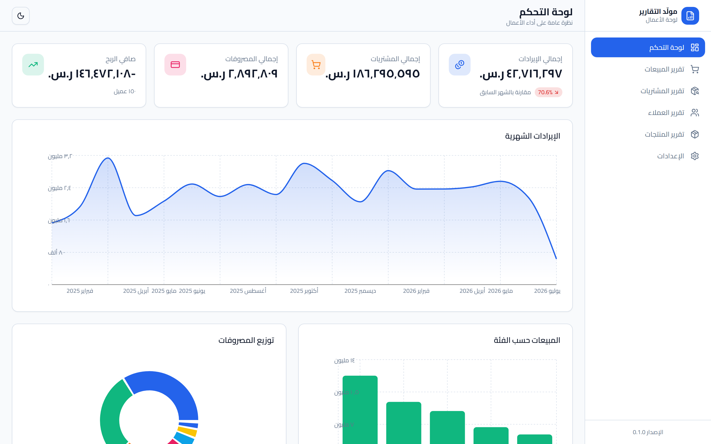
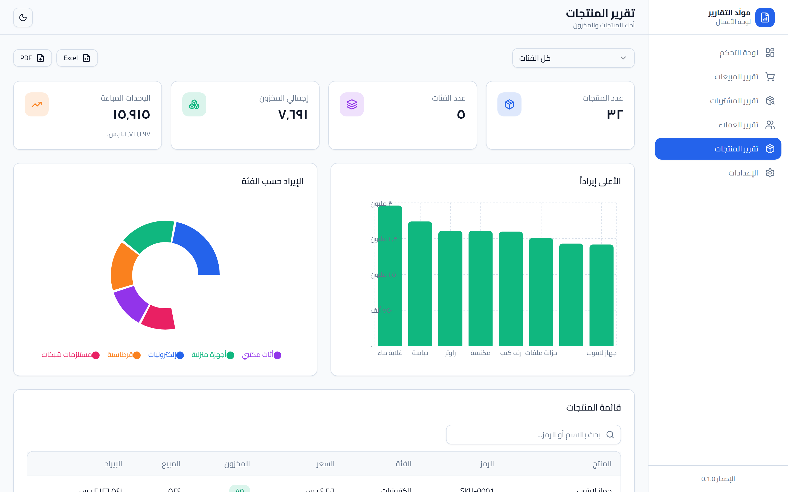

# 📊 التقرير النهائي للمشروع — مولّد التقارير (Report Generator)

> آخر تحديث: 2026-07-12 · الحالة: **مكتمل** ✅ · الريبو: <https://github.com/joudalbakkor/report>

---

## 1) نظرة عامة

**مولّد التقارير** هو لوحة أعمال (Business Dashboard) احترافية تعرض تقارير تحليلية
للمبيعات والمشتريات والعملاء والمنتجات، بواجهة عربية كاملة (RTL) مع وضع فاتح/داكن
وتصدير إلى Excel و PDF. بُني على مدى 6 مراحل متتابعة.

- **Frontend:** React 19 + TypeScript + Vite + TailwindCSS + shadcn/ui + Recharts
- **Backend:** FastAPI + SQLAlchemy 2.0 + Pydantic v2 (قاعدة بيانات SQLite)
- **الفروع:** `main` (إنتاج) · `develop` (تطوير)

---

## 2) الميزات المُنفّذة

| الميزة | الحالة |
|--------|:------:|
| لوحة تحكم بمؤشرات أداء ورسوم بيانية | ✓ |
| تقرير المبيعات (رسوم + جدول + فلترة) | ✓ |
| تقرير المشتريات | ✓ |
| تقرير العملاء | ✓ |
| تقرير المنتجات (مع تنبيه المخزون المنخفض) | ✓ |
| بحث وفلترة لحظية في الجداول | ✓ |
| وضع فاتح/داكن/تلقائي (localStorage) | ✓ |
| تصميم متجاوب (Responsive) + RTL عربي | ✓ |
| تصدير Excel (SheetJS) | ✓ |
| تصدير PDF مع نص عربي صحيح | ✓ |
| REST API كامل (CRUD) لكل الكيانات | ✓ |
| بيانات واقعية مُولّدة (Seed) | ✓ |
| اختبارات Backend (تغطية 100%) | ✓ |
| اختبارات واجهة (Playwright) | ✓ |
| مصادقة/صلاحيات المستخدمين | ✗ (خارج النطاق الحالي) |
| قاعدة بيانات إنتاجية (PostgreSQL) + Alembic | 🔄 (مقترح مستقبلي) |

## 3) إحصائيات الكود

| الفئة | الملفات | الأسطر |
|-------|:------:|:------:|
| Backend (Python) | 30 | 1,184 |
| Frontend (TS/TSX) | 33 | 2,731 |
| Styles (CSS) | 2 | 269 |
| اختبارات E2E (JS/TS) | 9 | 381 |
| ملفات الإعداد | 8 | 208 |
| **الإجمالي** | **82** | **4,773** |

## 4) نتائج الاختبارات

### Backend — Pytest + Coverage
- **31 اختباراً — كلها ناجحة ✅**
- **التغطية: 100%** (المطلوب 80%+) — مفروضة عبر `--cov-fail-under=80` في `pytest.ini`.
- تشمل: كل نقاط النهاية (CRUD مُعامَل لكل الكيانات الخمسة)، حالات 404/422،
  خدمة `CRUDService`، ودالة `get_db`.

### Frontend — Playwright + تحقق فعلي بمتصفح حقيقي (7/7)
| السيناريو | النتيجة |
|-----------|:------:|
| تحميل لوحة التحكم (بيانات + رسوم) | ✅ |
| بحث نصّي في المبيعات | ✅ (1200 → 21 سجل) |
| فلتر الفئة (Select) | ✅ (→ 179 سجل) |
| تصدير Excel | ✅ ملف `.xlsx` بمحتوى عربي صحيح |
| تصدير PDF | ✅ ملف `.pdf` بنص عربي متصل RTL |
| الوضع الداكن | ✅ |

> ملاحظة: `npx playwright test` قد يقتل الطرفية على Windows (خلل في إدارة webServer
> لمجموعة عمليات الطرفية). للتشغيل: استخدم `PW_NO_SERVER=1` مع تشغيل الخوادم يدوياً،
> أو السكربت المستقل `node frontend/e2e/run-screens.mjs` / `verify.mjs`.

## 5) أمثلة على التقارير (لقطات الشاشة)

جميع اللقطات في `docs/screenshots/`:

| # | الصفحة | الملف |
|---|--------|-------|
| 1 | لوحة التحكم (فاتح) | `01-dashboard.png` |
| 2 | تقرير المبيعات | `02-sales.png` |
| 3 | تقرير المشتريات | `03-purchases.png` |
| 4 | تقرير العملاء | `04-customers.png` |
| 5 | تقرير المنتجات | `05-products.png` |
| 6 | الإعدادات | `06-settings.png` |
| 7 | لوحة التحكم (داكن) | `07-dashboard-dark.png` |




## 6) البيانات المُولّدة (Seed Data)

بيانات واقعية عربية (أسماء ومدن سعودية، فئات منتجات، موردون) عبر `backend/seed_data.py`
ببذرة عشوائية ثابتة (`seed=42`) لضمان قابلية إعادة الإنتاج:

| الكيان | العدد |
|--------|:----:|
| العملاء (Customers) | 150 |
| المنتجات (Products) | 32 |
| المبيعات (Sales) | **1,200** |
| المشتريات (Purchases) | **600** |
| المصروفات (Expenses) | 300 |

## 7) التحديات والحلول

| التحدّي | الحل |
|---------|------|
| **النص العربي في PDF** — مكتبات jsPDF تفصل الحروف العربية وتعكسها. | استخدام `html2canvas` لالتقاط الـ DOM بعد أن يُشكّله المتصفح، ثم إدراج الصورة في jsPDF → نص عربي متصل وصحيح. |
| **`html2canvas` لا يدعم `color-mix()`** فتفشل صامتاً. | استبدال دوال الألوان الحديثة بـ `hsla()` القديمة. |
| **Node مخفي على Windows** — ملف stub فارغ في System32 يحجب Node الحقيقي. | استخدام المسار الكامل / وضع `C:\Program Files\nodejs` في مقدمة PATH. |
| **`playwright test` يقتل الطرفية** على Windows بسبب إدارة webServer. | جعل `webServer` اختيارياً (`PW_NO_SERVER`) + سكربتات تحقق مستقلة تدير دورة حياة الخوادم داخل Node. |
| **تجاوز حدّ الترقيم** — 1200 مبيعة > حدّ 1000 للـ API. | دالة `fetchAll` تُرقّم الصفحات تلقائياً حتى جلب كل السجلات. |
| **TypeScript صارم** (`verbatimModuleSyntax`, `types: [vite/client]`). | استيراد الأنواع صراحةً بـ `import type` بدل الاعتماد على نطاق React العام. |

## 8) خطوات التشغيل

```bash
# استنساخ
git clone https://github.com/joudalbakkor/report.git && cd report

# Backend
cd backend
python -m venv .venv && .venv\Scripts\activate     # Windows
pip install -r requirements.txt
python seed_data.py
uvicorn app.main:app --reload                       # http://127.0.0.1:8000/docs

# Frontend (نافذة أخرى)
cd frontend
npm install
npm run dev                                         # http://localhost:5173
```

**الاختبارات:** `cd backend && pytest` · `cd frontend && npx playwright test`

---

## 9) سجل المراحل (Milestones)

| المرحلة | الوصف | الحالة |
|:------:|-------|:-----:|
| 1 | إنشاء الـ Repository + الفروع | ✅ |
| 2 | Backend الأساسي (Models, API, Seed) | ✅ |
| 3 | Frontend + الواجهات | ✅ |
| 4 | ربط Frontend بـ Backend + التصدير | ✅ |
| 5 | الاختبارات (Pytest 100% + Playwright) | ✅ |
| 6 | التقرير النهائي + التوثيق | ✅ |
