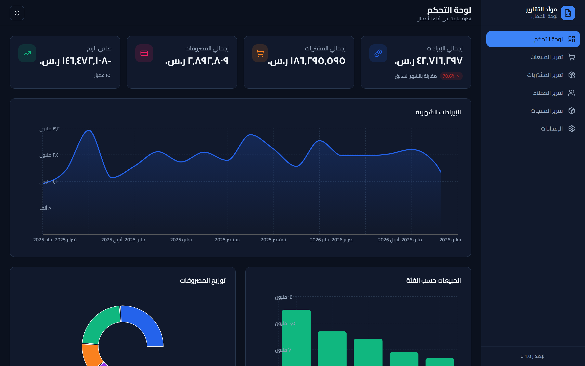
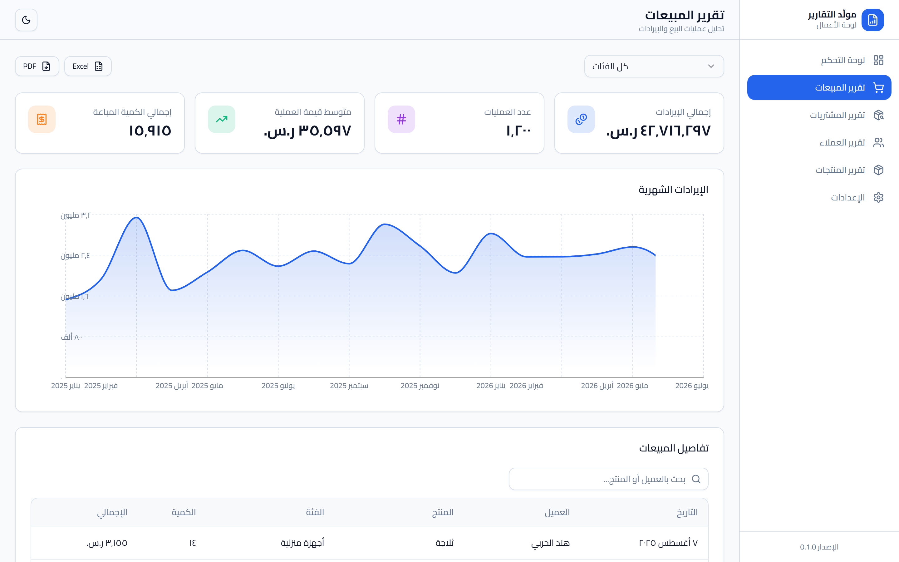
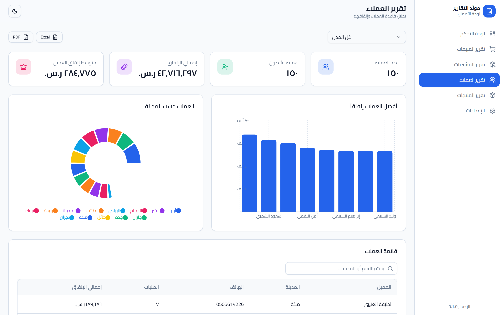
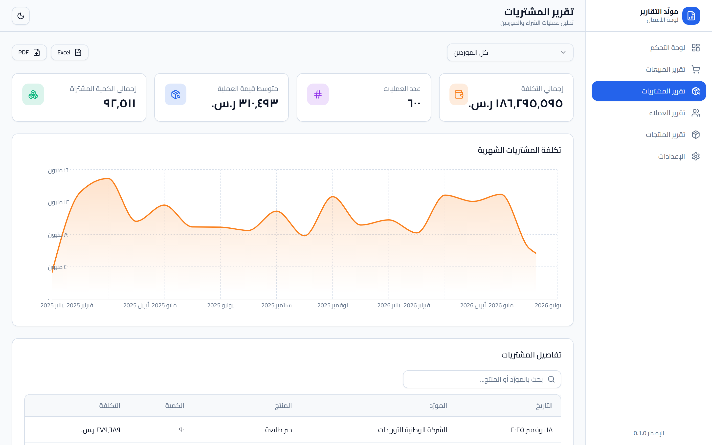

<div align="center">

# 📊 مولّد التقارير | Report Generator

**لوحة أعمال احترافية لتوليد التقارير التحليلية — عربية بالكامل (RTL) مع وضع فاتح/داكن وتصدير PDF/Excel.**

A professional, fully‑Arabic (RTL) business analytics & reporting dashboard with light/dark mode and PDF/Excel export.


</div>


---

## ✨ المميزات | Features

- 🖥️ **لوحة تحكم** بمؤشرات أداء (KPIs) ورسوم بيانية تفاعلية.
- 📈 **٤ تقارير**: المبيعات، المشتريات، العملاء، المنتجات — لكلٍّ رسومه وجداوله.
- 🔎 **بحث وفلترة** لحظية في كل جدول (بحث نصّي + فلاتر Select).
- 🌗 **وضع فاتح/داكن/تلقائي** محفوظ في المتصفح.
- 📱 **تصميم متجاوب** (Responsive) بالكامل مع دعم **RTL** عربي (خط Cairo).
- 📤 **تصدير Excel و PDF** — مع ظهور **النص العربي بشكل صحيح** في ملف الـ PDF.
- ⚡ **API سريع** بـ FastAPI + بيانات واقعية مُولّدة (1200+ مبيعة).

## 🖼️ لقطات الشاشة | Screenshots

| لوحة التحكم (فاتح) | لوحة التحكم (داكن) |
|:---:|:---:|
|  |  |

| تقرير المبيعات | تقرير المنتجات |
|:---:|:---:|
|  |  |

| تقرير العملاء | تقرير المشتريات |
|:---:|:---:|
|  |  |

## 🧱 التقنيات | Tech Stack

| الطبقة | التقنيات |
|--------|----------|
| **Frontend** | React 19 · TypeScript · Vite · TailwindCSS · shadcn/ui · Recharts · React Router |
| **Backend** | FastAPI · SQLAlchemy 2.0 · Pydantic v2 · Uvicorn |
| **Database** | SQLite |
| **التصدير** | SheetJS (Excel) · html2canvas + jsPDF (PDF عربي) |
| **الاختبارات** | Pytest + coverage · Playwright |

## 🚀 التثبيت | Installation

**المتطلبات:** Python 3.12+ و Node.js 20+.

```bash
git clone https://github.com/joudalbakkor/report.git
cd report

# 1) Backend
cd backend
python -m venv .venv
.venv\Scripts\activate            # Windows  (Linux/macOS: source .venv/bin/activate)
pip install -r requirements.txt
python seed_data.py               # توليد بيانات واقعية

# 2) Frontend
cd ../frontend
npm install
```

## ▶️ التشغيل | Usage

شغّل الخادمين في نافذتين منفصلتين:

```bash
# Terminal 1 — Backend  (http://127.0.0.1:8000 ، التوثيق /docs)
cd backend && uvicorn app.main:app --reload

# Terminal 2 — Frontend (http://localhost:5173)
cd frontend && npm run dev
```

ثم افتح <http://localhost:5173>.

## 🧪 الاختبارات | Testing

```bash
# Backend — وحدات + تغطية (100%)
cd backend && pytest

# Frontend — اختبارات واجهة (Playwright)
cd frontend && npx playwright test
```

## 📁 هيكل المشروع | Project Structure

```
report/
├── backend/            # FastAPI + SQLAlchemy
│   ├── app/            # models · schemas · services · api · core · db
│   ├── tests/          # pytest (100% coverage)
│   └── seed_data.py
├── frontend/           # React + TypeScript + Vite
│   ├── src/            # components · pages · services · lib · hooks
│   └── e2e/            # Playwright tests + verification scripts
├── docs/screenshots/   # لقطات الشاشة
├── PROJECT_REPORT.md   # التقرير التفصيلي
└── README.md
```

## 🤝 المساهمة | Contributing

المساهمات مرحّب بها. الرجاء:
1. عمل Fork وإنشاء فرع `feature/<name>` من `develop`.
2. اتباع صيغة **Conventional Commits** (`feat:`, `fix:`, `docs:`, `test:`, `refactor:`).
3. التأكد من نجاح الاختبارات قبل فتح Pull Request نحو `develop`.

## 📄 الرخصة | License

هذا المشروع مرخّص تحت رخصة **MIT** — راجع ملف [LICENSE](LICENSE).
